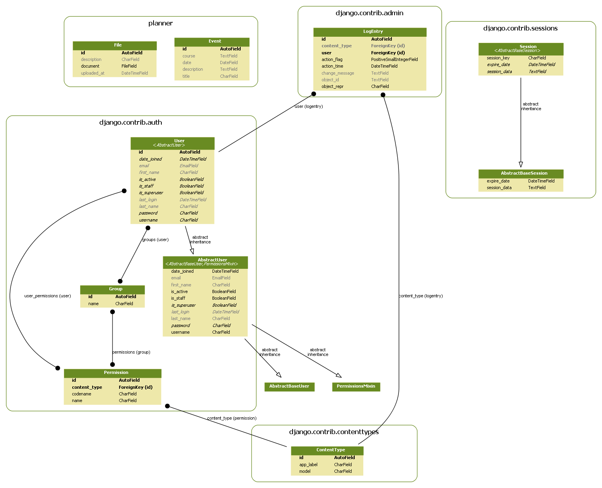

# Academic Calednar

### Overview:
The goal of this project was to create a calendar to be used by a company and operated by an Academic Officer.
The calendar would accept manual inputs for events defined by the Academic Officer and/or read a syllabus and
automatically populate the calendar with each lesson. This would enable a company to have all their academic events
in a centralized location they could access, while at the same time allows the Academic Officer to monitor  academic workloads
for each week and provide recommendations to the command team on whether a training event is feasible at a particular time.

### Architecture:

### Testing:
When you access the website below, change the month to April to see a more populated month.
Testing was done with a syllabus from the History Department for HI302 (Military Art) where the lesson
schedule was stored in a docx table. When on the admin site to utilize the auto-population capability
just add a new event but leave everything blank and click save.

### Known Issues:
* Very restricted in what files file_reader can read (only docx files)

### Recommended Improvements:
* Improve the file_reader file to be more universal in lesson searching
* Enable week highlighting (To identify thayer weeks)
* Enable event colorcodings (quickly decipher which events are for either plebes, yuks, cows, and/or firsties)

### Links:
* [Website](www.outlook.pythonanywhere.com/planner)
* [Django Documentation](https://docs.djangoproject.com/en/2.2/ref/)
